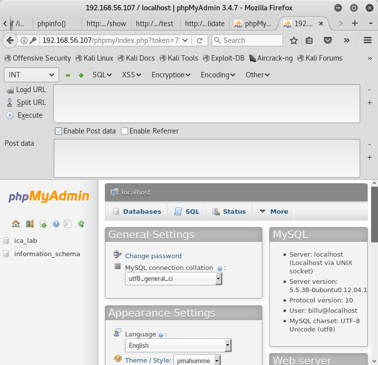
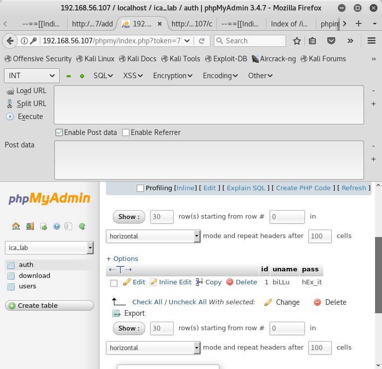
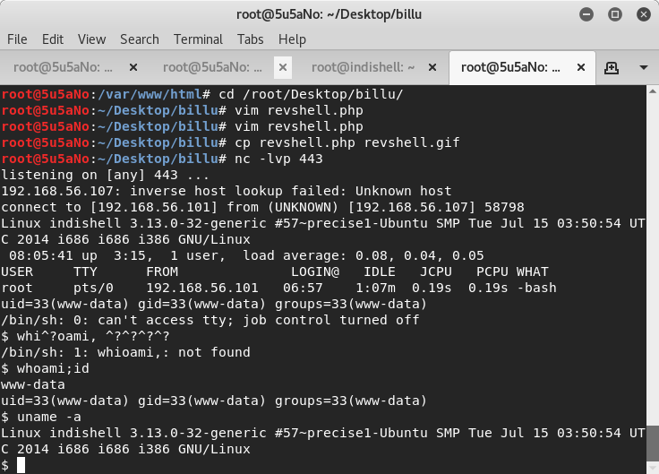
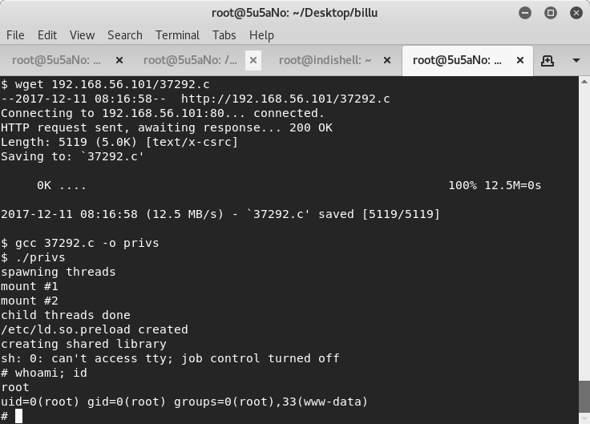

### target:			billu_b0x by Manish Kishan Tanwar
### hosted by:			vulnhub.com
### virtualization software: 	virtualbox
### testing platform:		kali linux 2017
### walkthrough by:		worzel-gummidge


after using **nmap** to get the IP of the target, a more comprehensive nmap scan of all ports is performed.

```bash
nmap 192.168.56.107 -T5 -n -p0-65535 -A -sC
```


2 open ports are discovered, tcp22(ssh) and tcp80(http). **nikto** and **dirb** scans are run for more information via port tcp80.

```bash
nikto -h http://192.168.56.107
```

```bash
dirb http://192.168.56.107
```


manually browsing through the webpage using the report from **dirb** as a guide, a few web forms are discovered. at the root directory, a challenge to *'test your sqli skills'* is offered up.
**burp** is started and configured as a proxy. using **burp** to capture the web requests, a text file for each form is created and fed to **sqlmap**. **sqlmap** reports that none of the forms is injectable.
moving on to the other pages discovered by **dirb**. *http://target/test* looks interesting.
using **curl**, a post request is made to *http://target/test* with the parameter file and value */etc/passwd*. the page obediently offers up the */etc/passwd* file. the webpage discloses files from the server if the path and name of the file are entered as the value for the file parameter.

```bash
curl -d "file=/etc/passwd" http://192.168.56.107/test
```


the other files found by **dirb** with a '200' code are passed as the file value. *c.php* discloses what seems to be a username and password.


this combination is used to attempt to login to ssh and the main login of *http://target* to no avail.
there must be another login page not yet discovered. a larger wordlist is used with **dirb**. phpmyadmin login page is found and the login credentials found in *c.php* are accepted.



after logging in, another user, password combination is found. these credentials are used to login to the *http://target page*. the attacker is redirected to *http://target/panel*, where there are options to *'show users'* or *'add user'*.



the new user is promted to uplaod an image onto the server. attempting to upload a php file with the .php extension is unsuccessful. prepending 'GIF89a' to the reverse php shell and changing the file extension to .gif allows the attacker to upload a reverse shell to the server.
capturing the post request of *http://target/panel* through **burp** reveals the parameter *'load'* with value *'show'*. through **dirb**, a file named *show.php* had already been discovered. load must therefore run php files. before the attacker replaces the value 'show' with the path and file name for the uploaded reverse php shell, the attacker uses **netcat** to setup a listener on his/her local machine.
the modified post request is sent and the attacker has a shell.



the kernel version is out of date and a quick search via **searchsploit** offers the attacker with a priviledge escalation exploit.
after moving to the */tmp* directory, using **wget**, the attacker downloads the exploit from his/her local machine. the exploit is complied on the web server and run.
the attacker now has root access to the server.


