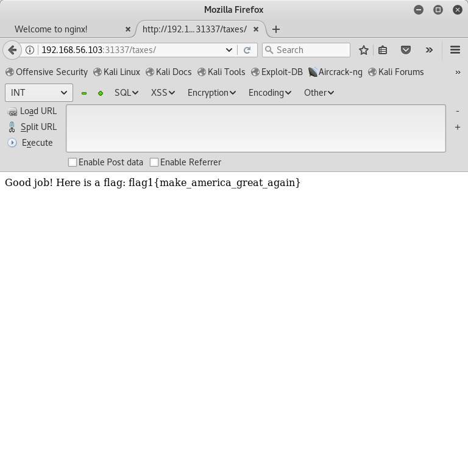
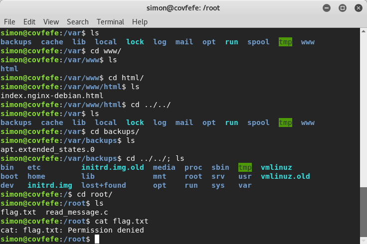
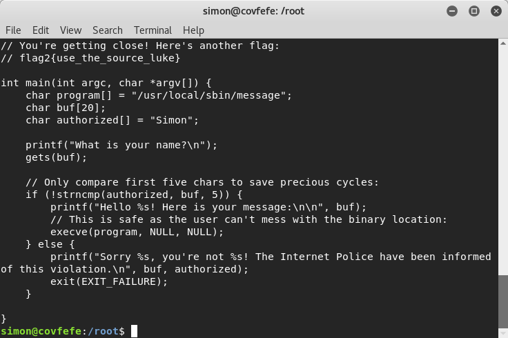
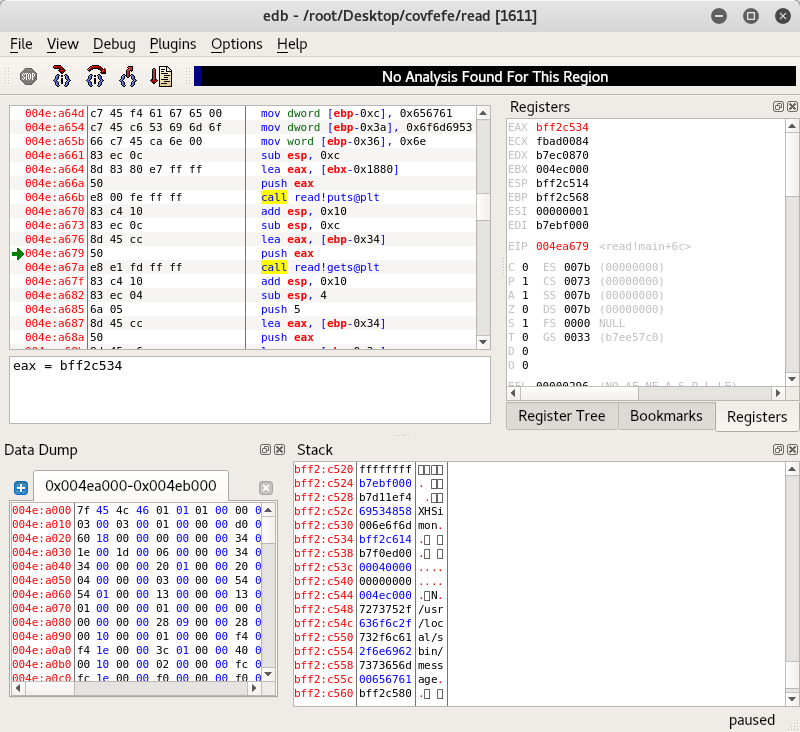
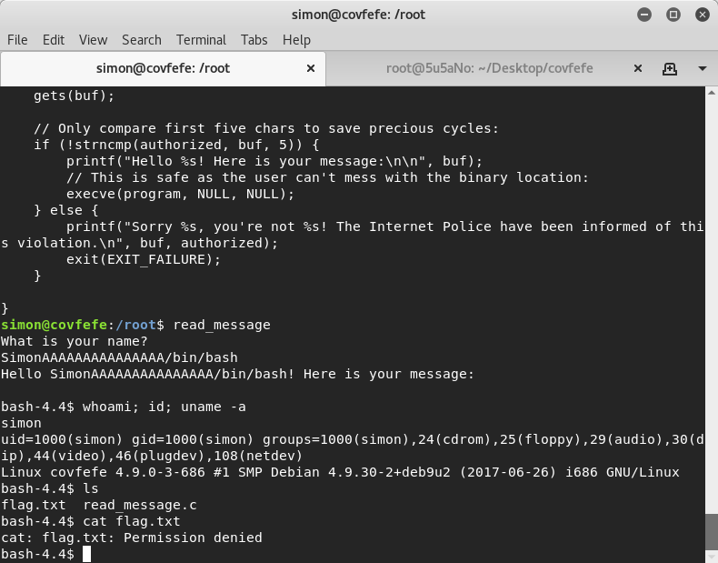
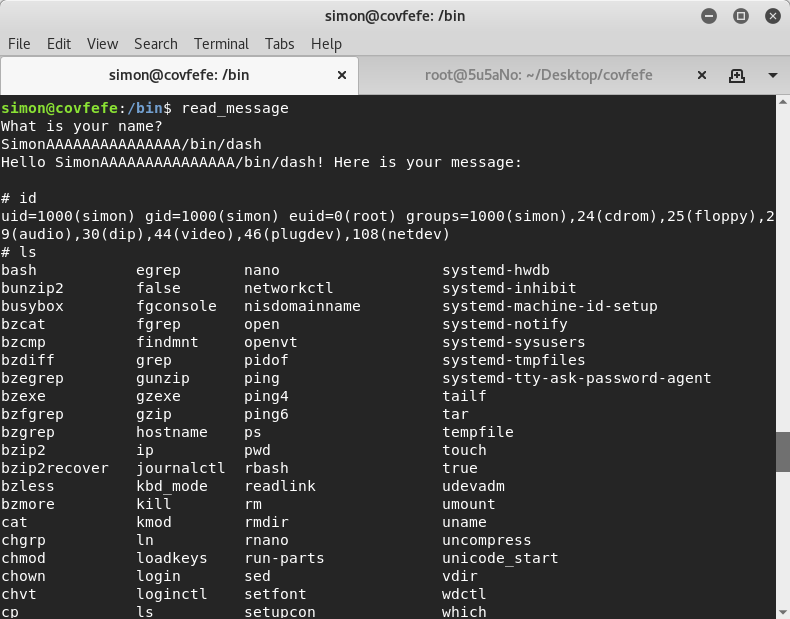
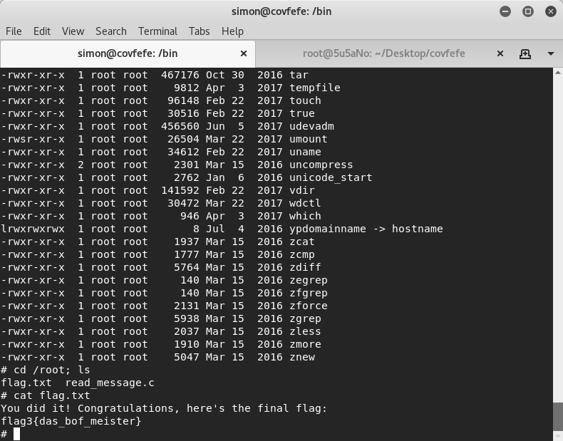

#### target:			covfefe by Tim Kent

#### hosted by:			vulnhub.com

#### virtualization software: 	virtualbox

#### testing platform:		kali linux 2017

#### walkthrough by:		worzel-gummidge

after using **nmap** to find the IP of the target, **nmap** is used again to discover open ports. 3 open ports tcp22(ssh), tcp80(http) and tcp31337(http) are found.

**nikto** and **dirb** scanners are run to gather more information on port 80 and 31337. *http://target:31337/taxes*, *http://target:31337/.bash_history*, *http://target:31337/.bashrc*, *http://target:31337/.profile*, *http://target:31337/.ssh*, *http://target:31337/robots.txt* are found.

a flag is captured at *http://target:31337/taxes*



the *.ssh* folder contains *'authorized_keys'*, *'id_rsa'*, *'id_rsa.pub'*. by storing the keys in */root/.ssh* the attacker should be able to login to the server via **ssh** without a password.

the keys are password protected so an attacker would need to crack the password before he/she is able to ssh into the server. **john** is used to do just that.

```bash
john --rules shadow --show
```


after a while the password is obtained and the attacker is able to get a shell as user ''***simon***''. the attacker doesn't have root priviledges.

there are 2 files in the */root* folder: *flag.txt* and *read_message.c*. user "***simon***" does not have privileges to read the *flag.txt* file.




*read_message.c* has another flag. this is the source code for a program that reads messages for the user. the author of this program has used unsafe functions, particularly the *gets()* function. the program also calls another program, */usr/local/sbin/message*. from simple inspection, if the attacker is able to overflow the buffer that contains the user's name, he/she may be able to take control of the program.




the attacker can manually copy the source code onto his/her local machine and inspect the program more carefully using a debugger.

using **edb** the attacker may place a breakpoint after the call to *gets()*. the stack shows that */usr/local/sbin/message* is located 15 bytes from the user controlled input.




replacing */usr/local/sbin/message* with */bin/bash* gets the user a limited shell still without privileges.




replacing */usr/local/sbin/message* with */bin/dash* gets the attacker a limited shell with root privileges. the attacker can now read */root/flag.txt*.






