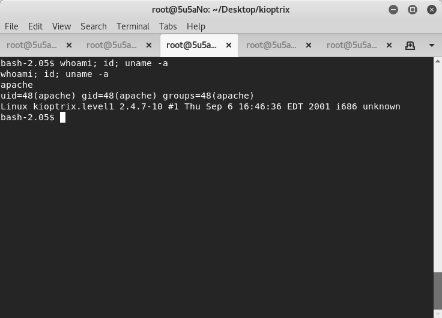
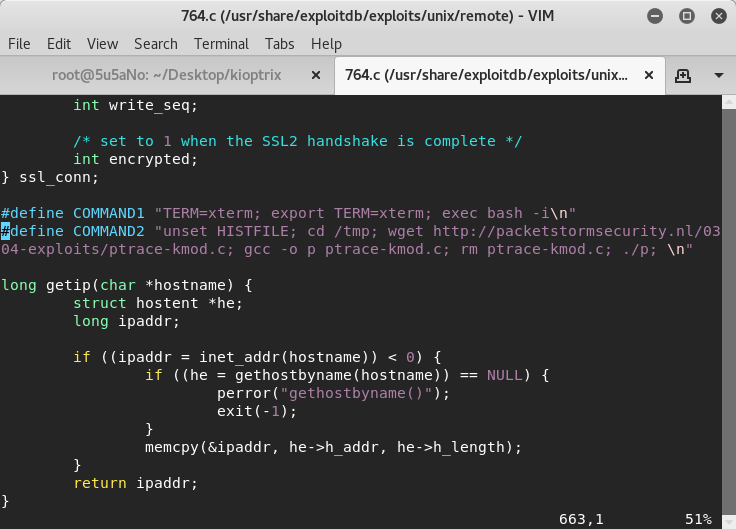
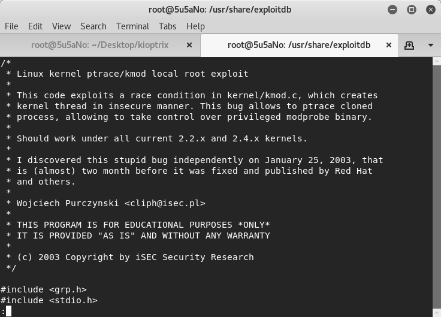
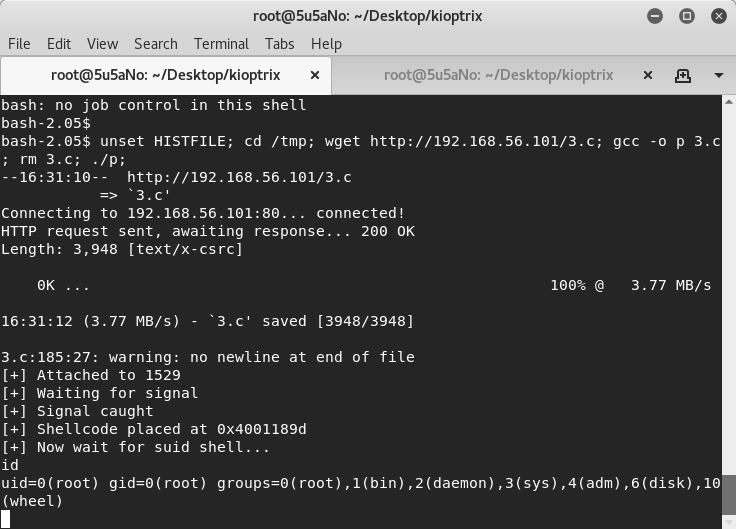

### target:			kioptrix by Kioptrix Team 

### hosted by:			vulnhub.com 

### virtualization software: 	virtualbox 

### testing platform:		kali linux 2017 

### walkthrough by:		worzel_gummidge 


**nmap** is used to find the target and perform a port scan of the target.

```bash
nmap 192.168.56.102 -T5 -A -sC -p0-65535 -n
```


6 open ports are found: *tcp22(ssh)*, *tcp80(http)*, *tcp111(rpcbind)*, *tcp139(smb)*, *tcp443(https)*, *tcp32768*.

further probing is done on *port 80* with **nikto** and **dirb**. **nikto** reports that *ssl_mod 2.8.7* and below is vulnerable to a remote buffer overflow.

```bash
nikto -h 192.168.56.102
```

```bash
dirb http://192.168.56.102 /usr/share/dirb/wordlists/big.txt
```


the attacker uses **searchsploit** to find an exploit for the vulnerability. the exploit is compiled and run.

the attacker gets a remote shell without root priviledges. as the exploit is run the attacker receives warnings. the code is attempting to fetch another exploit, compile, and run it but fails.




after identifying the second expoit the first exploit is attempting to download, the attacker uses **searchsploit** to find the second exploit and modifies the first exploit code to point to the exploit from his/her local machine.






the modified exploit is compiled and run and the attacker now has root.


