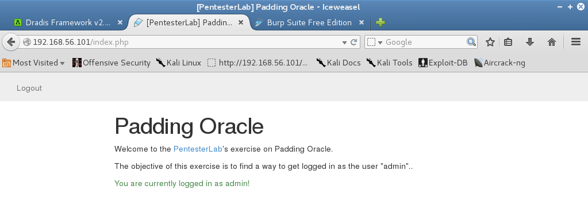

###target:					Padding Oracle by Pentester Lab 

###hosted by:				vulnhub.com 

###virtualization software: 	virtualbox 

###testing platform:		kali linux 2017 

###walkthrough by:			worzel_gummidge 


**nmap** is used to find the target and perform a port scan of the target.

```bash
nmap 192.168.56.101 -T5 -A -sC -p0-65535 -n
```


3 open ports are found: *tcp22(ssh)*, *tcp80(http)*, *tcp3306(mysql)*.

since this virtual machine is named *Padding Oracle* the attacker focuses on *tcp80*. using **firefox** and **burp** as a proxy the attacker connects to the web page hosted on *port 80*. with intercept turned on in **burp** the attacker follows the instructions on the home page and creates a new user and logs in. in an attempt to trigger a padding oracle, the attacker modifies the cookie by adding a couple of 'a's to the *auth* cookie.


knowing that a padding oracle exisits the attacker registers a new user and captures the http request, sending it to **burp repeater** and finally forwarding the request. the server responds with an *auth* cookie.


the attacker uses **padbuster**.

```bash
padbuster http://192.168.56.101/login.php LJw%2BMi8XmtdBmMVOGA%2FWomSZWJ6s9uMP 8 -cookies authLJw%2BMi8XmtdBmMVOGA%2FWomSZWJ6s9uMP -error Invalid padding
```


**padbuster** reveals the plaintext form of the cookie. to successfully log in as admin the attacker needs to replace his/her cookie with an encrypted 'user=admin' cookie. using **padbuster**: 

```bash
padbuster http://192.168.56.101/login.php LJw%2BMi8XmtdBmMVOGA%2FWomSZWJ6s9uMP 8 -cookies authLJw%2BMi8XmtdBmMVOGA%2FWomSZWJ6s9uMP -error Invalid padding -plaintext user=admin
```


with **burp** intercept still enabled, the attacker logs back in with his/her original credentials then modifies the 'auth' value to the encrypted form of the 'user = admin' string retrieved from **padbuster**.


the attacker is now logged in as admin

