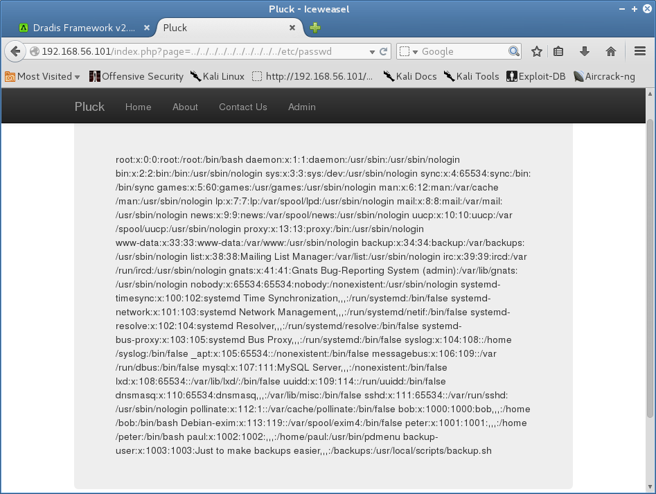
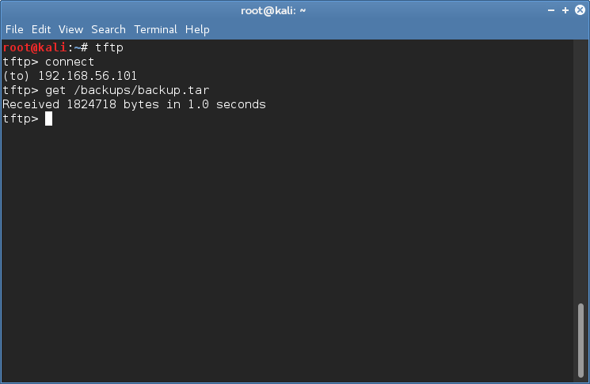
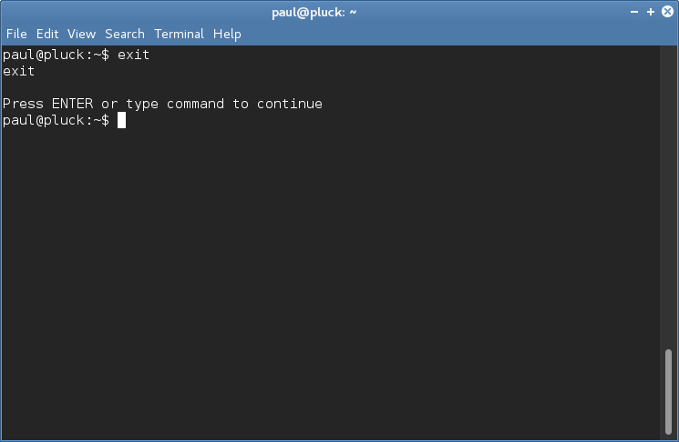
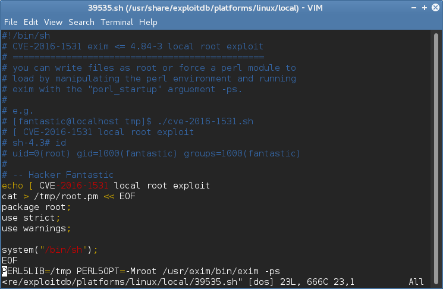
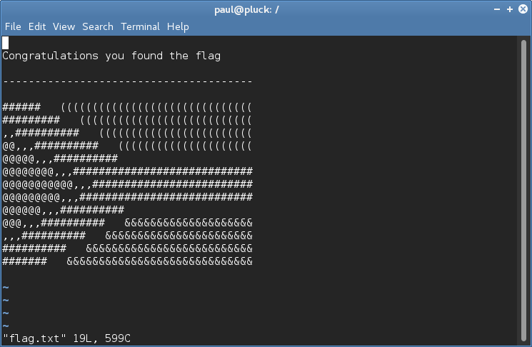

### target:			Pluck by @ryanoberto 

### hosted by:			vulnhub.com 

### virtualization software: 	virtualbox 

### testing platform:		kali linux 2017 

### walkthrough by:		worzel_gummidge 


**nmap** is used to find the target and perform a port scan of the target.

```bash
nmap 192.168.56.103 -T5 -A -sC -p0-65535 -n
```


4 open ports are discovered: *tcp22(ssh)*, *tcp80(http)*, *tcp3306(mysql) and* *tcp5355*.

the attacker runs **dirb** and **nikto** scans on *tcp80*.

```bash
dirb http://192.168.56.101 /usr/share/dirb/wordlists/big.txt
```

```bash
nikto -h 192.168.56.101
```


nikto reports a potential path traversal vulnerability. the attacker uses his/her favourite browser to retrieve the */etc/passwd* file.



the attacker finds the absolute path to a *bash script* on the server and exploits path traversal to read the file. the script reveals that the backup files can be retrieved via *tftp*




the attacker finds keys in /home/paul/keys and uses them with 'paul' as the username to get an *ssh* session on the remote host. to escape the '**Pdmenu**', the attacker chooses the 'Edit file' option to get access to **vim**. once in **vim**, the attacker issues commands to set the shell and execute it.

```vim
:set shell=/bin/bash
```

```vim
:!bash
```



to gain root privileges, the attacker gets a list of all processes running with root privileges on the remote host and searches for a vulnerable program from the list.

```bash
find -perm -4000
```


a suitable exploit for **exim** is found. the attacker could manually enter the commands into the shell and gain root privileges.




the attacker has the flag.


