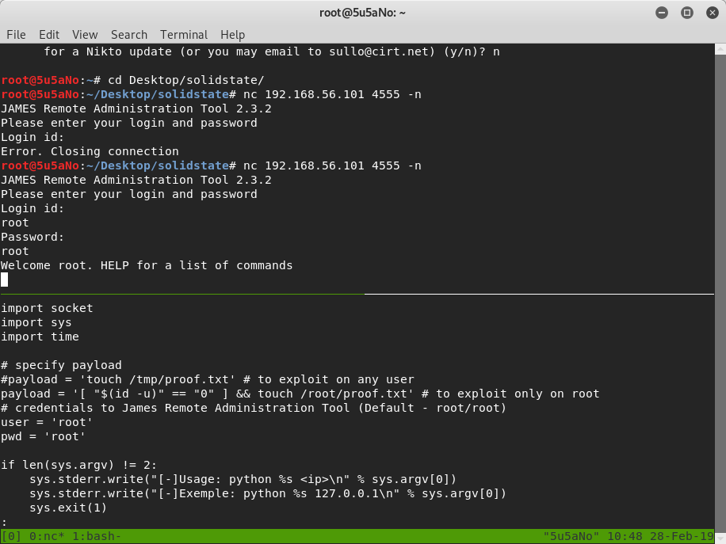
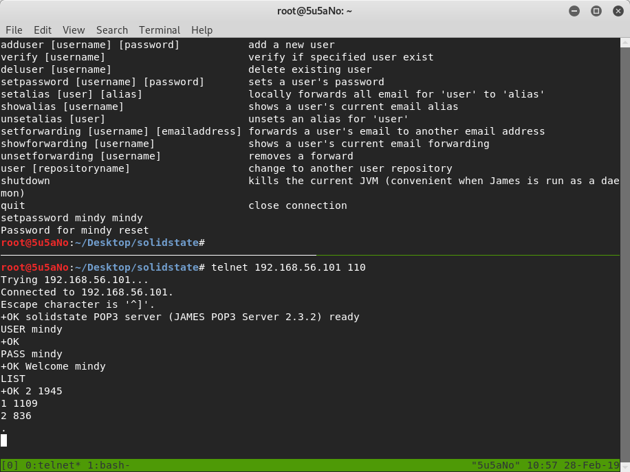
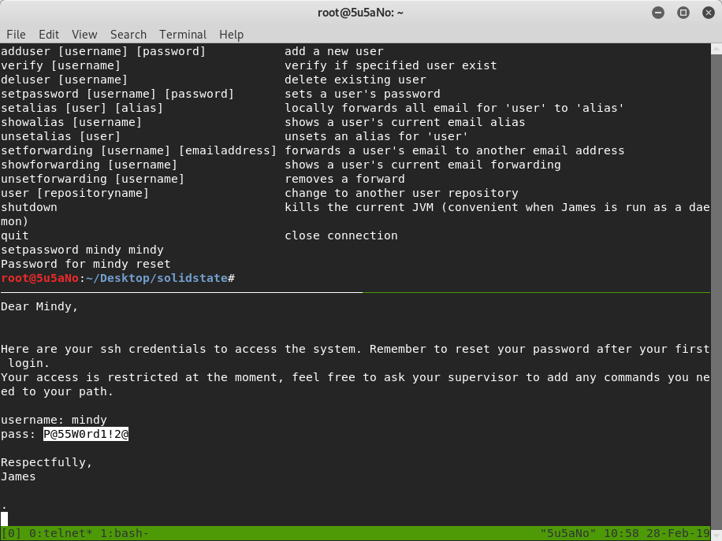
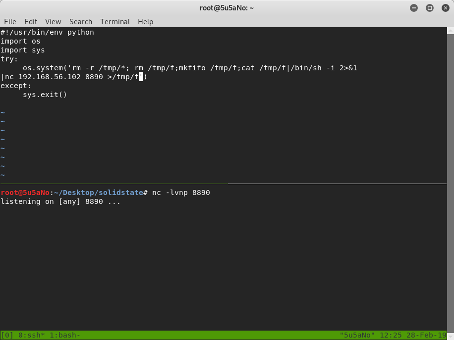
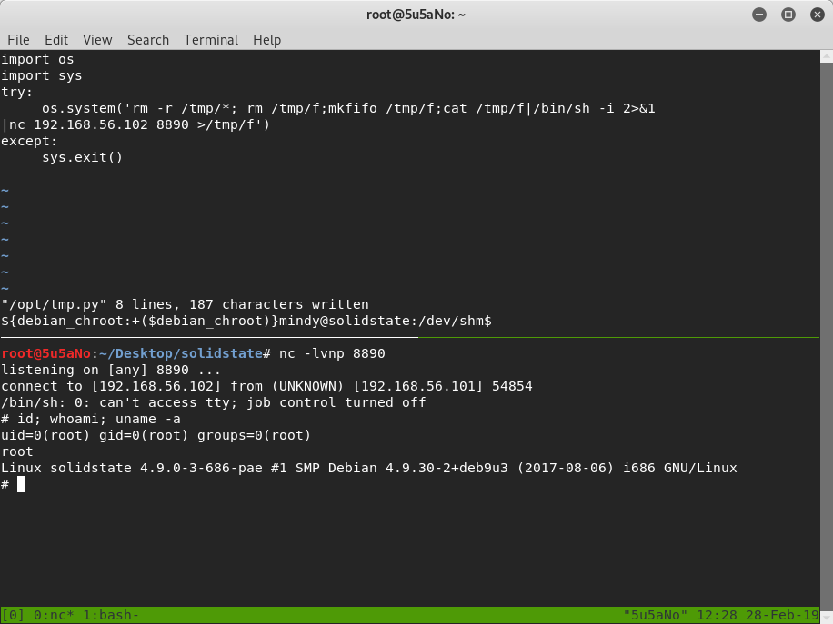

### target:			SolidState:1 by Ch33_plz
### hosted by:			vulnhub.com
### virtualization software: 	virtualbox
### testing platform:		kali linux 2017
### walkthrough by:		worzel-gummidge

the attacker uses **nmap** to discover open ports and the services running on them. open ports are *22tcp(ssh)*, *25tcp(smtp)*, *80tcp(http)*, *110tcp(pop3)*, *119tcp(nntp)*, *4555tcp(james-admin)*.
```bash
nmap -A -n -T5 -p- http://target
```

**searchsploit** is used to search for known exploits for each service being run on the open ports. the attacker finds default credentials from an exploit for port *4555tcp*.
```bash
searchsploit JAMES 2.3.2
```




the attacker uses default credentials to login and reset user mindy's password. this allows the attacker to use the new password to login to user mindy's e-mail on port 110tcp. the attacker finds an e-mail with user mindy's ssh credentials.





after the attacker logs into the remote server using user mindy's ssh credentials, he/ she finds himself/ herself in a restricted shell. to get around this, the attacker logs into the remote host via ssh with user mindy's credentials and **bash** as an argument.

```bash
ssh mindy@remote-host bash
```

the attacker now has a shell on the remote server without root privileges. to gain root access, the attacker edits a python script running with root privileges.
```bash
find / -perm 002
vi /opt/tmp.py
```



the attacker sets up a **netcat** handler on the localhost and waits patiently for the python scripton the remote host to execute. After the script executes the attacker gains root privileges on the remote server.
```bash
nc -lvpn 8890
```
 
