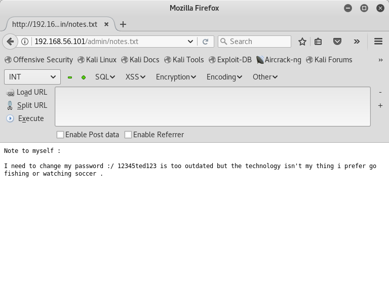
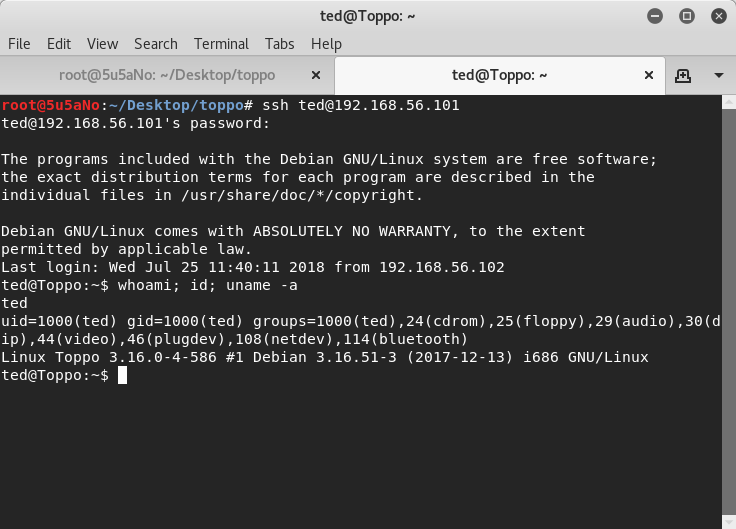
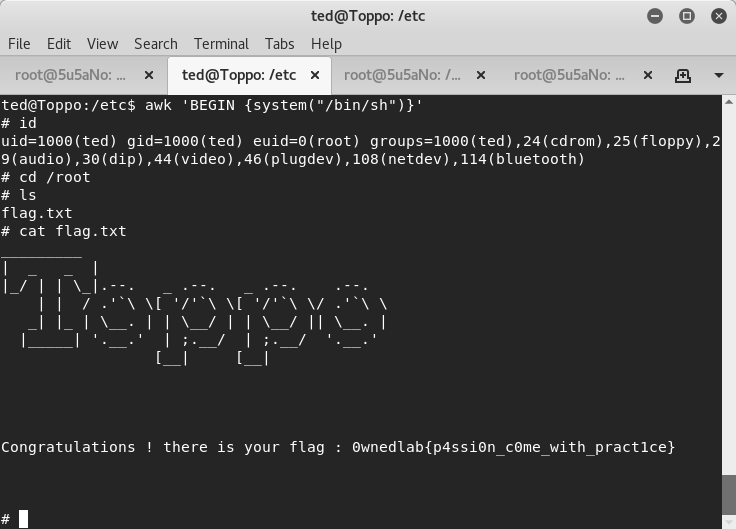

### target:			Toppo: 1 by @h4d3sw0rm
### hosted by:			vulnhub.com
### virtualization software: 	virtualbox
### testing platform:		kali linux 2017
### walkthrough by:		worzel-gummidge

**nmap** is used to discover open ports. 4 open ports tcp22(ssh), tcp80(http), tcp111(rpcbind) and tcp58081(http) are found.
```bash
nmap -A -n -T5 -p1-65535 http://target
```

**nikto** and **dirb** scanners are run to gather more information on tcp80(http). both scanners find listable directory *http://target/admin*. the attacker finds a text file named notes.txt in the *http://target/admin* directory and it contains what looks like a password.
```bash
nikto -h http://target
```
```bash
dirb http://target /usr/share/dirb/wordlists/big.txt
```




the attacker uses the password with the username "ted" to login to the target machine using *ssh*. the user ted does not have root privileges.



the attacker reads the sudoers file and notices he is able to execute *awk* in the context of root and spawns a shell using *awk* to gain root access.
```bash
awk 'BEGIN {system("/bin/sh")}'
```


